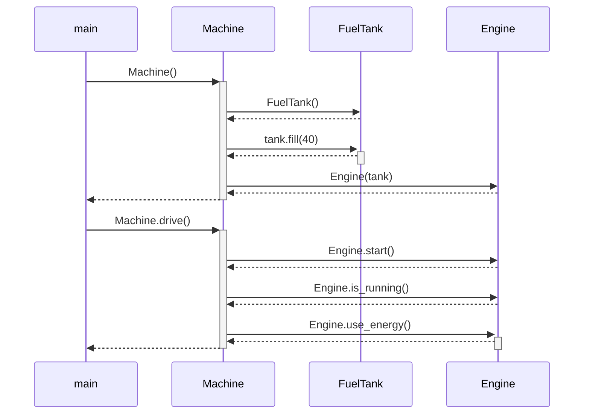

```mermaid
sequenceDiagram
	participant main
	participant M as Machine
	participant F as FuelTank
	participant E as Engine
	main ->>+M: Machine()
	M->>F: FuelTank()
	F-->>M:	
	M->>+F: tank.fill(40)
	F-->>-M:	
	M->>E: Engine(tank)
	E-->>M:	
	M-->>-main:	
	main->>+M: Machine.drive()
	M->>E: Engine.start()
	E-->>M:	
	M->>E: Engine.is_running()
	E-->>M:	
	M->>+E: Engine.use_energy()
	E-->>-M:	
	M-->>-main:	
```
