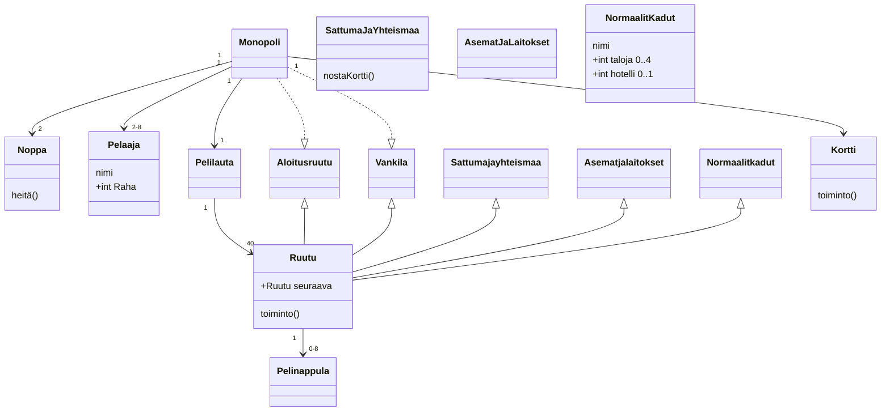

```mermaid
classDiagram
	Monopoli "1" --> "2" Noppa
	Monopoli "1" --> "2-8" Pelaaja
	Monopoli "1" --> "1" Pelilauta
	Pelilauta "1" --> "40" Ruutu
	Ruutu "1" --> "0-8" Pelinappula
	Aloitusruutu <|-- Ruutu
	Vankila <|-- Ruutu
	Sattuma ja yhteismaa <|-- Ruutu
	Asemat ja laitokset <|-- Ruutu
	Normaalit kadut <|-- Ruutu
	Monopoli ..|> Vankila
	Monopoli ..|> Aloitusruutu
	Monopoli "1" --> Kortti
	class Monopoli{
	
}
	class Pelaaja{
		nimi
		+int Raha
}
	class Pelilauta{
	
}
	class Noppa{
		heitä()
}
	class Ruutu{
		+Ruutu seuraava
		toiminto()
}
	class Pelinappula{
	
}
	class Aloitusruutu{
	
}
	class Vankila{
	
}
	class SattumaJaYhteismaa{
		nostaKortti()
}
	class AsematJaLaitokset{
	
}
	class NormaalitKadut{
		nimi
		+int taloja 0..4
		+int hotelli 0..1
}
	class Kortti{
		toiminto()
}

```
