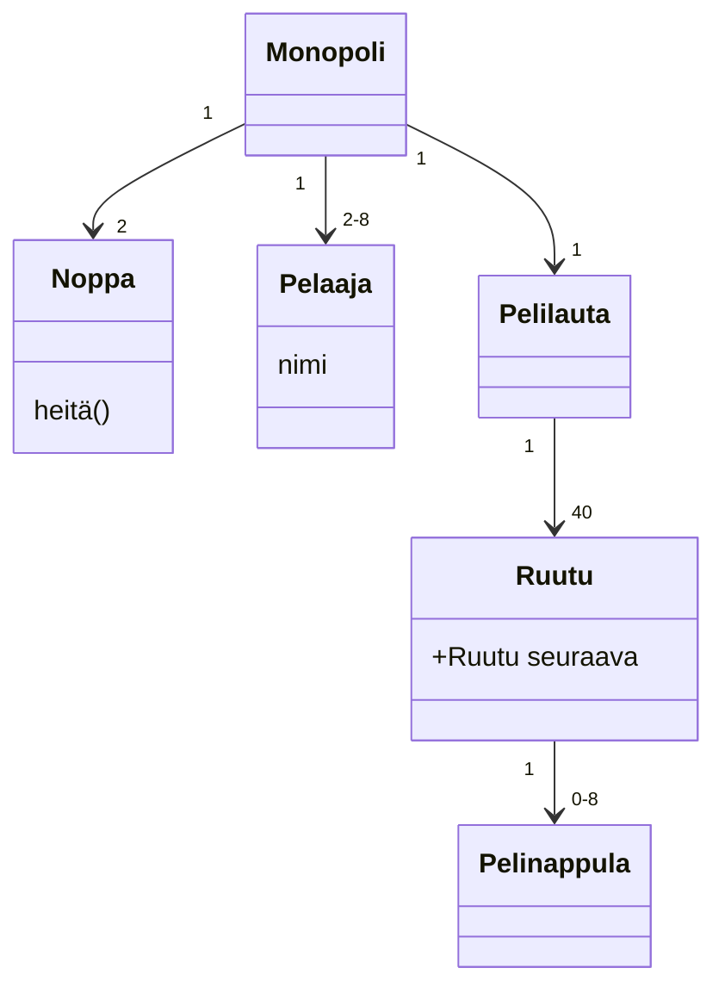

```mermaid
classDiagram
	Monopoli "1" --> "2" Noppa
	Monopoli "1" --> "2-8" Pelaaja
	Monopoli "1" --> "1" Pelilauta
	Pelilauta "1" --> "40" Ruutu
	Ruutu "1" --> "0-8" Pelinappula
	class Monopoli{
}
	class Pelaaja{
		nimi
}
	class Pelilauta{
}
	class Noppa{
		heitä()
}
	class Ruutu{
		+Ruutu seuraava
}
	class Pelinappula{
}
```
